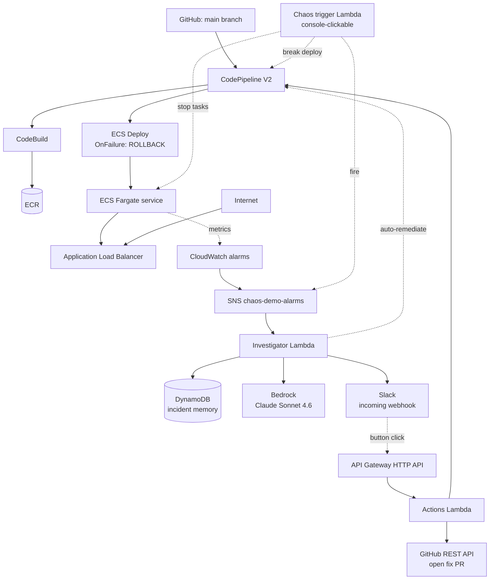

# AIOps CI/CD pipeline

A self-healing CI/CD pipeline on AWS, with an LLM-driven incident
investigator on top of CloudWatch alarms.

When a deploy fails or a production alarm fires, an investigator Lambda
gathers ECS state, container logs, pipeline history, and the most-recent
commit's diff, asks Claude (via Amazon Bedrock) for a structured root-
cause analysis, and posts a Slack message with confidence, risk, and
four buttons: trust the auto-rollback, run a rollback now, open a fix
PR on GitHub, or delegate. With auto-remediation enabled, the Lambda
can act on its own when confidence and risk are within configured
limits. Repeat incidents are recognised through a DynamoDB memory layer
so the LLM call is skipped entirely.

## Why this exists

"Self-healing pipeline" demos usually stop at `OnFailure: ROLLBACK` and
call it a day. That handles the symptom (the bad deploy) but not the
diagnosis (why it broke, what to change). I wanted to push past the
YAML-only version and see how far one can get with a small amount of
code, a careful prompt, and three layers of intelligence:

1. **Memory** - skip the LLM call when an incident repeats.
2. **Reasoning** - call Claude with a structured prompt that demands
   exact-match find/replace patches.
3. **Action** - either a human clicks a Slack button or the
   auto-remediation gate fires the same code path.

## Key features

- **CodePipeline V2** with `OnFailure: ROLLBACK` on the Deploy stage
- **Bedrock-backed RCA** (Claude Sonnet 4.6) with a structured JSON
  schema: confidence, risk, implicated files, exact-match patches
- **DynamoDB incident memory** keyed on a normalised signature; PAY_PER_REQUEST + TTL
- **Slack interactivity** via API Gateway + HMAC signature verification
- **GitHub PR creation** that never pushes to `main` and refuses
  ambiguous patches
- **Console-clickable chaos trigger** with four pre-saved test events
  (clear memory, fire alarm, stop tasks, break deploy)
- **Confidence-based auto-remediation gate** with explicit reason
  strings on every block

## Architecture



A longer narrative version lives in [`docs/architecture.md`](docs/architecture.md).

## Tech stack

- **AWS** CloudFormation (8 nested stacks), CodePipeline V2, CodeBuild,
  ECR, ECS Fargate, Application Load Balancer, CloudWatch alarms +
  dashboard, SNS, DynamoDB, API Gateway HTTP API, Lambda, IAM, SSM
  Parameter Store, Bedrock
- **App** Node.js 18, Express, Docker (multi-stage not needed; tiny app)
- **Investigator** Python 3.12, boto3, urllib (no third-party deps)
- **CI/CD** CodePipeline V2 with `OnFailure: ROLLBACK` and the ECS
  deployment circuit breaker
- **LLM** Anthropic Claude Sonnet 4.6 via Bedrock cross-region inference
  profile (`us.anthropic.claude-sonnet-4-6`)

## Repository structure

```
App/                            Express API + Dockerfile + healthcheck
buildspec.yml                   CodeBuild build steps
cloudformation/
  main.yaml                     parent stack
  vpc.yaml                      VPC, subnets, optional NAT
  ecs.yaml                      ECR, cluster, ALB, target group, service
  pipeline.yaml                 CodePipeline V2 + CodeBuild + IAM
  monitoring.yaml               CloudWatch alarms + SNS + dashboard
  investigator.yaml             investigator Lambda + DynamoDB memory
  investigator-interactions.yaml HTTP API + actions Lambda + IAM
  chaos-trigger.yaml            console-clickable chaos Lambda
  chaos.yaml                    optional FIS templates (off by default)
lambda/
  investigator/index.py         memory + Bedrock + auto-remediation
  investigator-actions/index.py Slack button dispatch + PR creation
  chaos-trigger/index.py        4-mode demo trigger
scripts/
  deploy.sh                     two-phase deploy (count=0 then count=2)
  destroy.sh                    teardown
  run-chaos.sh                  triggers ecs:StopTask without FIS
docs/                           architecture, setup, usage, ADRs, draft
tests/test_signature.py         unit tests on the pure investigator funcs
```

## Setup

Full step-by-step: [`docs/setup.md`](docs/setup.md). Short version:

1. Create a CodeStar GitHub Connection in the AWS console; copy the ARN.
2. Create a Slack app (Incoming Webhook + Interactivity); copy the
   webhook URL and signing secret.
3. (Optional) Create a fine-grained GitHub PAT with repo write access
   if you want the PR feature.
4. Store the three secrets in SSM SecureString.
5. Run `bash scripts/deploy.sh` with the connection ARN.

### Environment variables

All managed via CFN parameters or Lambda env. Placeholder values:

| Parameter | Example | What it does |
|---|---|---|
| `GitHubOwner` | `your-username` | Repo owner for the pipeline source |
| `GitHubRepo` | `AIOps-AWS` | Repo name |
| `GitHubBranch` | `main` | Branch the pipeline watches |
| `GitHubConnectionArn` | `arn:aws:codeconnections:...` | CodeStar connection ARN |
| `AutoRemediateEnabled` | `false` | Master switch for auto-rollback / auto-PR |
| `AutoRemediateConfidenceThreshold` | `0.85` | Claude's confidence must beat this |
| `AutoRemediateAllowedActions` | `rollback,create_pr` | Allow-list for auto actions |
| `AutoRemediateRequireLowRisk` | `true` | Restrict auto to LOW risk only |
| `IncidentMemoryEnabled` | `true` | Toggle memory layer |
| `IncidentMemoryTtlDays` | `90` | Memory row expiry |
| `MemoryMinSuccessCount` | `1` | Reuse a memory only after N successes |

Three secrets in SSM (placeholders shown):

```bash
aws ssm put-parameter \
  --name /chaos-demo/investigator/slack-webhook-url \
  --value "https://hooks.slack.com/services/PLACEHOLDER" \
  --type SecureString --region ap-southeast-2

aws ssm put-parameter \
  --name /chaos-demo/investigator/slack-signing-secret \
  --value "PLACEHOLDER_SIGNING_SECRET" \
  --type SecureString --region ap-southeast-2

aws ssm put-parameter \
  --name /chaos-demo/investigator/github-token \
  --value "github_pat_PLACEHOLDER" \
  --type SecureString --region ap-southeast-2
```

## How to run the demo

Full guide: [`docs/usage.md`](docs/usage.md).

Short version: open the `chaos-demo-chaos-trigger` Lambda's Test tab in
the AWS console (URL is in the `ChaosTriggerConsoleUrl` stack output)
and save these test events:

| Event name | JSON | What you'll see in Slack |
|---|---|---|
| `clear-memory` | `{"mode":"clear_memory"}` | (no message) DDB cleared |
| `fire-alarm-fresh` | `{"mode":"fire_alarm","reason":"..."}` | "Fresh investigation" RCA, ~15s |
| `fire-alarm-repeat` | same as above | "Memory hit", ~1s |
| `stop-tasks` | `{"mode":"stop_tasks"}` | Real alarm + RCA from real logs |

## Testing

Pure-function unit tests live in `tests/test_signature.py`. Run:

```bash
python3 -m unittest tests.test_signature
```

The tests exercise the parts of the investigator that have no AWS
side effects: `normalize_error`, `build_incident_signature`, and
`auto_action_for` (the auto-remediation gate). 16 tests, no external
dependencies, runs in under a second.

The Lambda integration paths (Bedrock, DynamoDB, CodePipeline, GitHub
API, Slack) are exercised by deploying to AWS and using the
chaos-trigger Lambda. There are no fake mocks for those paths because
mocking the LLM is worse than just running it.

## Screenshots

Drop these into `docs/screenshots/` and update the references when you
have them.

- `docs/screenshots/slack-fresh-investigation.png` - the Slack RCA on a
  memory miss, with confidence + risk + four buttons
- `docs/screenshots/slack-memory-hit.png` - the same alarm firing
  again, "Memory hit" banner, no Bedrock call
- `docs/screenshots/chaos-trigger-console.png` - the Lambda Test tab
  with the four saved events
- `docs/screenshots/generated-pr.png` - a PR opened by the actions
  Lambda after a button click

## Cost

Approximate at idle, default config:

| Resource | Monthly |
|---|---|
| ECS Fargate (2 x 0.25 vCPU / 0.5 GB) | ~$10 |
| Application Load Balancer | ~$16 |
| CodePipeline V2 (per active pipeline) | ~$1 |
| CloudWatch logs + alarms | <$2 |
| ECR (5-image lifecycle) | <$0.05 |
| S3 artifact bucket (30d expiry) | <$0.10 |
| DynamoDB incident memory | <$0.10 |
| API Gateway HTTP API | <$0.05 |
| Bedrock Claude Sonnet 4.6 | ~$0.05 / investigation |
| **Total idle** | **~$30 / month** |

## Challenges and learnings

A condensed list. Long version in [`docs/decisions.md`](docs/decisions.md)
and [`docs/medium-article-draft.md`](docs/medium-article-draft.md).

- **AWS DevOps Agent silently failed** on both Free and Paid Plan in
  this region. CloudTrail showed its IAM role was never assumed. We
  built our own investigator on Bedrock instead.
- **AWS FIS is gated on Free Plan.** The default chaos path uses
  `aws ecs stop-task` instead. FIS templates remain available behind
  `EnableChaos=true`.
- **Two-phase deploy** is required because ECR is empty on first
  deploy. `scripts/deploy.sh` deploys with `DesiredCount=0` first,
  triggers the pipeline, then updates to `DesiredCount=2`.
- **Find/replace patches beat unified diffs** for LLM-generated fixes.
  Diffs are hard to apply against a moving file; find/replace fails
  cleanly when ambiguous instead of landing a half-applied patch.
- **`aws-marketplace:Subscribe` is a real IAM permission** that Bedrock
  Lambda roles need on first invocation of a model the account hasn't
  yet subscribed to.
- **Confidence scoring is more useful than a yes/no recommendation.**
  Claude's confidence is ~0.5 on synthetic alarms and ~0.85+ on real
  broken commits with diff context. Threshold becomes the system's
  risk dial.

## Future improvements

- Idempotency on the SNS subscription via a small DynamoDB lock to
  dedupe alarm-storm retries.
- Per-user authorisation in the actions Lambda; currently anyone in
  the Slack channel can press rollback.
- Bedrock budget alarms.
- A signed audit trail of auto-remediation actions beyond the Slack
  post and Lambda log line.
- Real GitHub PR comments instead of the Kiro handoff option (Kiro
  isn't installed in our workspace).

## Author

**Adithya Subas** - cloud / DevOps / AIOps engineer.

If you're reading this from a portfolio link: the most interesting
files are `lambda/investigator/index.py` (memory + Bedrock + the
auto-remediation gate, ~370 lines) and `cloudformation/investigator.yaml`
(the IAM and DynamoDB schema). The Medium article that walks through
the build is in [`docs/medium-article-draft.md`](docs/medium-article-draft.md).

## License

MIT - see [LICENSE](LICENSE).
