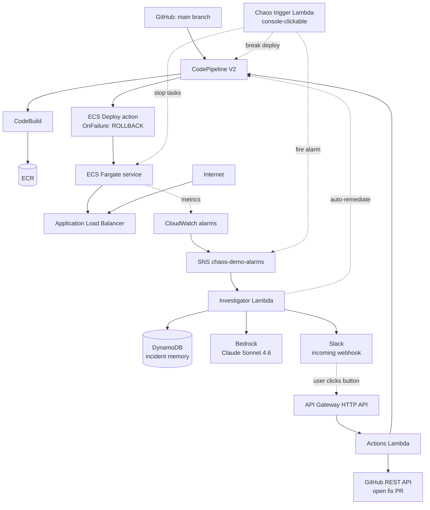

# Architecture

This is a self-healing CI/CD pipeline for an ECS Fargate service, with an
LLM-driven incident investigator on top of CloudWatch alarms.

## At a glance

## Three layers of intelligence

The investigator is the brain of the system. It does three things in
sequence on every alarm.

### 1. Memory (DynamoDB)

Every investigation builds a stable signature from the alarm name,
service, normalised error log content (timestamps and request IDs
stripped), and the failed pipeline stage. If the same signature has been
seen and resolved before, the Lambda reuses the stored decision and skips
the Bedrock call entirely. PAY_PER_REQUEST billing, TTL on the row, no
scans.

The signature build is in `lambda/investigator/index.py:build_incident_signature`
and the test in `tests/test_signature.py` exercises both the
`normalize_error` cleanup and the SHA-256 hashing.

### 2. Reasoning (Bedrock + Claude Sonnet 4.6)

On a memory miss, the Lambda gathers ECS service state, the last 15
container log lines, the last 5 pipeline executions, and the diff of the
most recent commit (via the GitHub REST API). It sends all of that to
Claude with a structured prompt asking for:

- root cause and deploy correlation
- implicated files and an excerpt of the offending lines
- a fix as exact-match find/replace patches (so the actions Lambda can
  apply them without ambiguity)
- four options for the human (trust auto-rollback, run rollback, open PR,
  delegate to Kiro)
- a confidence score (0-1), risk level (LOW / MEDIUM / HIGH), and an
  explicit `auto_remediation_safe` boolean

### 3. Action (CodePipeline + GitHub)

Either an operator clicks a Slack button or the auto-remediation gate
fires. Both go through the same code paths.

- **Rollback** uses `codepipeline:RollbackStage` first. If AWS rejects
  it (common - it only accepts forward-deploy successes as targets),
  the Lambda resolves the target execution's commit SHA via
  `GetPipelineExecution` and re-runs the pipeline pinned to that SHA via
  `start-pipeline-execution --source-revisions`. So the fallback is a
  real rollback, not a no-op re-run of HEAD.

- **Create fix PR** is intentionally narrower than applying a unified
  diff. Each patch is a single-file find/replace. The Lambda fetches the
  current file via the GitHub Contents API, refuses if `find` is not an
  exact substring or if the path has any traversal pattern, replaces the
  first occurrence only, commits to a fresh `aiops-fix/<signature>-<ts>`
  branch, and opens a PR back to `main`. It never pushes to `main`.

## Auto-remediation gate

For an action to fire automatically (no human click), all of these must
be true. The gate is in `lambda/investigator/index.py:auto_action_for`.

- `AUTO_REMEDIATE_ENABLED=true` (master switch)
- `confidence >= AUTO_REMEDIATE_CONFIDENCE_THRESHOLD` (default 0.85)
- `risk_level == LOW` (or MEDIUM if `AUTO_REMEDIATE_REQUIRE_LOW_RISK=false`)
- `auto_remediation_safe == true` (Claude's own safety check)
- `recommended_option` is in `AUTO_REMEDIATE_ALLOWED_ACTIONS`
- For `create_pr`, at least one valid patch is present

If anything fails, the Slack message includes a `:lock:` line stating
exactly which gate failed, so thresholds can be tuned based on observed
behaviour.

## Slack interactivity

API Gateway HTTP API → actions Lambda. Every request is verified by
HMAC-SHA256 over `v0:<timestamp>:<raw body>` against the Slack signing
secret stored in SSM SecureString. Replay window is 5 minutes.

Buttons carry a JSON `value` payload with the alarm context, the
Bedrock-generated patches, the rollback target execution id, and the
recommended option. The actions Lambda parses that, dispatches on
`action_id`, and posts the result back via Slack's `response_url`.

## Component map

| Concern | Resource | Defined in |
|---|---|---|
| App | Express on Fargate, 2 tasks | `App/`, `cloudformation/ecs.yaml` |
| Build & deploy | CodePipeline V2 + CodeBuild + ECR | `cloudformation/pipeline.yaml`, `buildspec.yml` |
| Detection | 4 CloudWatch alarms + SNS topic | `cloudformation/monitoring.yaml` |
| Investigator | Bedrock-backed Lambda + DDB memory | `cloudformation/investigator.yaml`, `lambda/investigator/` |
| Slack interactivity | HTTP API + actions Lambda | `cloudformation/investigator-interactions.yaml`, `lambda/investigator-actions/` |
| Demo trigger | Console-clickable Lambda | `cloudformation/chaos-trigger.yaml`, `lambda/chaos-trigger/` |
| Optional FIS | Experiment templates | `cloudformation/chaos.yaml` (off by default) |

## Deliberate limits

- **AWS DevOps Agent path was abandoned.** We initially built a webhook
  bridge to forward alarms to AWS DevOps Agent. The agent never produced
  a response on either Free or Paid Plan in our test region. We removed
  the bridge and built our own investigator on Bedrock. See
  `docs/decisions.md`.
- **AWS FIS is optional.** Free Plan accounts can't subscribe to FIS, so
  the default chaos path is `aws ecs stop-task` via the chaos-trigger
  Lambda.
- **PR creation uses find/replace, not unified diffs.** Diffs are hard
  to apply safely against a moving file. Find/replace with exact-match
  required is narrower but predictable.
- **Idempotency is not enforced.** SNS retries can fire the investigator
  twice for the same alarm transition. A small DynamoDB lock keyed on
  `<alarm,timestamp>` would dedupe.
